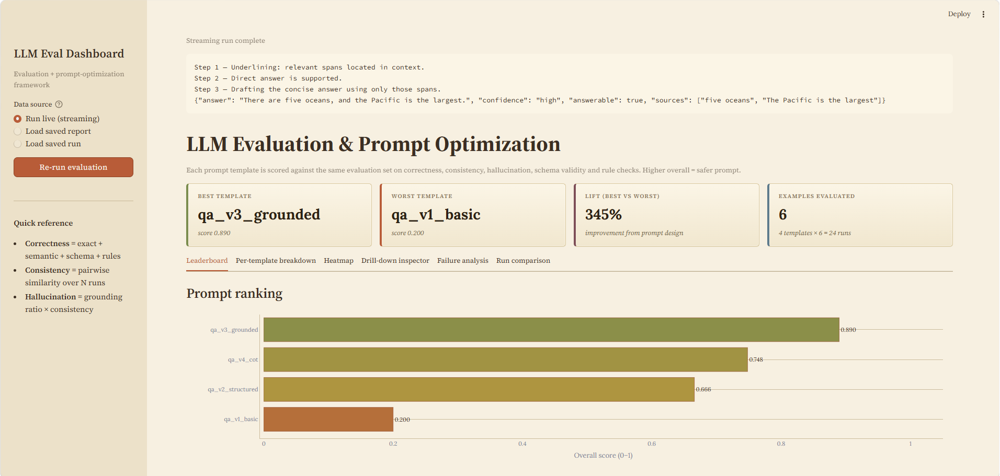
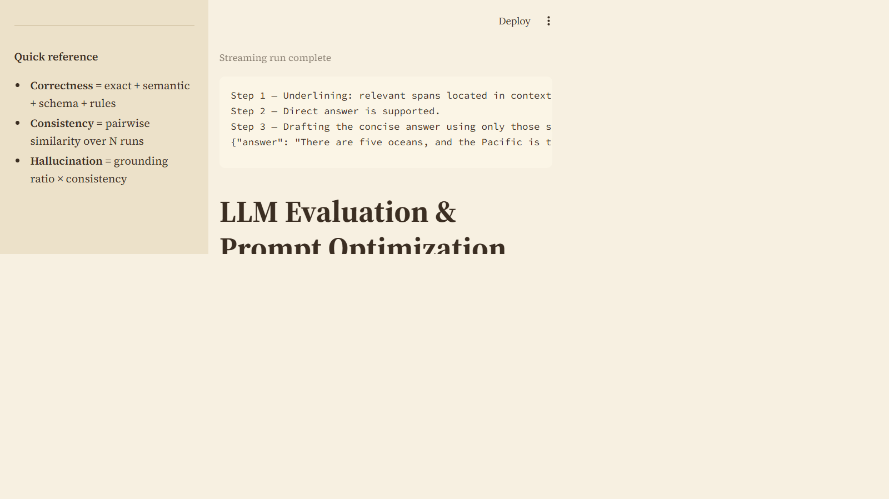

# LLM Evaluation Framework & Hallucination Reduction Study (`hallueval`)

An empirical study instrument and modular Python framework for evaluating Large Language Models, benchmarking hallucination-reduction techniques, and ranking prompt strategies by factual grounding and reliability.

> 📖 **Read Full Study Research Paper**: [`HALLUCINATION_REDUCTION_STUDY.md`](HALLUCINATION_REDUCTION_STUDY.md)  
> 📊 **Error Taxonomy Dataset**: [`reports/error_taxonomy_analysis.csv`](reports/error_taxonomy_analysis.csv)  
> 📈 **Study Execution Grid**: [`reports/study_results_grid.json`](reports/study_results_grid.json)

---

## 🔬 Hallucination Reduction Study Quickstart

Run the 40-cell empirical study grid (5 techniques × 4 models × 2 datasets):

```bash
pip install -r requirements.txt
python scripts/health_check.py     # verifies pipeline & study runner
python main.py run-study           # executes the multi-model grid study
```

Or using the packaged `hallueval` CLI:

```bash
pip install -e .
hallueval run-study --provider mock --datasets truthfulqa,halueval
```

The health check exits non-zero if anything is broken — run it before
demos. Expected output: 13 required checks pass, 1 optional skipped
(`anthropic` SDK).

This will:

1. Load the three sample prompts from `data/prompts/`.
2. Run each against the 6 examples in `data/dataset.json`.
3. Score every output on correctness, consistency, hallucination, schema
   validity, and rule checks.
4. Write a Markdown + JSON report to `reports/`.

You can also list templates:

```bash
python main.py list-templates
```

### Interactive dashboard (recommended for demos)

```bash
streamlit run dashboard.py
```

Opens at <http://localhost:8501> with:

- **KPI cards** — best/worst template, lift, total runs.
- **Leaderboard** — ranked bar chart + sub-metric grouped bars.
- **Per-template breakdown** — radar chart of strengths plus
  per-example tables.
- **Heatmap** — templates × examples grid; red cells flag failures
  at a glance.
- **Drill-down inspector** — pick a template/example, see the
  rendered prompt, the model output with **ungrounded terms
  highlighted in red**, the expected output, schema errors, rule
  pass/fail badges, and all consistency runs side-by-side.

A "Re-run evaluation" button in the sidebar re-executes the
framework live; switch to "Load saved report" to replay any JSON
under `reports/` (useful for offline / no-LLM presentations).

### Sample ranking (mock LLM)

```
=== Prompt Ranking ===
  1. qa_v3_grounded     avg=0.900
  2. qa_v2_structured   avg=0.696
  3. qa_v1_basic        avg=0.189
```

The numbers come straight from the demo run — see
`reports/evaluation_*.md` for the full per-example breakdown.

## Architecture

```
main.py                       # CLI entry point
dashboard.py                  # Streamlit dashboard
config.yaml                   # Provider, metric, weights, paths
src/
  llm/
    client.py                 # BaseLLMClient + provider factory
    mock_client.py            # Deterministic offline LLM
    openai_client.py          # OpenAI wrapper (optional)
    anthropic_client.py       # Anthropic wrapper (optional)
  metrics/
    exact_match.py            # Normalised string/JSON equality
    semantic_similarity.py    # TF-IDF cosine + optional embeddings
    rule_based.py             # Pluggable Rule registry + QA defaults
  schema/
    validator.py              # JSON-Schema validation w/ tolerant parsing
  evaluator/
    correctness.py            # Weighted blend of metrics + schema
    consistency.py            # Pairwise stability over N runs
    hallucination.py          # Grounding-ratio detector
    runner.py                 # Orchestrates one (template, example) pass
  prompts/
    manager.py                # Template registry + safe formatter
    optimizer.py              # Compare + rank templates
  reporting/
    reporter.py               # Markdown + JSON report writer
data/
  prompts/qa_v1_basic.txt     # No structure
  prompts/qa_v2_structured.txt# JSON instructions
  prompts/qa_v3_grounded.txt  # JSON + grounding rules + few-shot
  schemas/qa_schema.json      # Required output shape
  dataset.json                # 6 examples + canned mock responses
tests/                        # 25 unit tests
reports/                      # Generated reports land here
```

Every layer is replaceable through composition — see "Extending" below.

## How it scores

Each (prompt, example) evaluation produces:

### Correctness (weight 0.5)

A weighted blend of:

| Sub-metric            | What it measures                                                                        |
| --------------------- | --------------------------------------------------------------------------------------- |
| `exact_match`         | Strict equality after case/whitespace/JSON normalisation                                |
| `semantic_similarity` | Cosine similarity (TF-IDF or embeddings) between predicted and expected text            |
| `schema_valid`        | 1.0 if the output parses and conforms to `data/schemas/qa_schema.json`, else 0.0        |
| `rule_based`          | Pass-rate over weighted custom rules (e.g. "answer is non-empty", "confidence is enum") |

### Consistency (weight 0.2)

Runs the same prompt **N** times (default 3) and computes the mean pairwise
semantic similarity between outputs. A low score means the model is being
asked to be creative when it should be deterministic — a strong signal for
prompt instability.

### Hallucination (weight 0.3)

Tokenises the model output and the **grounding context** (expected answer

- supplied context). Any content tokens or numbers in the output that
  appear in neither are flagged as ungrounded. The detector outputs:

* `ungrounded_terms` — the literal tokens flagged
* `score` — 1 − (ungrounded / total content tokens)
* `combined_score` — `score × consistency` (because flaky outputs are also
  hallucination evidence)
* `is_hallucinated` — boolean against a configurable threshold

The combined score is the one used in the overall blend. Multiplying by
consistency exploits a real correlation: when a model is confident in a
factual claim it tends to repeat it across runs, so divergence + new
entities is a stronger signal than either alone.

## How this reduces hallucinations and improves reliability

The framework attacks hallucination from **four reinforcing directions**:

1. **Schema enforcement turns format failures into hard zeros.** The
   `qa_v1_basic` template scores 0/6 on schema validity because the model
   replies in prose. That collapse is visible at a glance, so prompts that
   "almost work" don't sneak into production. JSON Schema also forces the
   model to commit to fields like `answerable` and `sources`, which makes
   downstream code able to reject unsupported answers programmatically.

2. **Grounding-ratio detection surfaces fabricated facts.** In the demo,
   `qa-004` (Sydney Opera House cost) is unanswerable from the context.
   The basic prompt confidently invents "AUD 102 million", and the
   detector immediately flags `102`, `australian`, `1973` as ungrounded.
   The grounded prompt instead returns `"answerable": false` and scores
   1.0 on hallucination. Surfacing these terms tells a prompt author
   exactly **why** a prompt is unsafe — not just that the score went down.

3. **Consistency probing catches non-deterministic confabulation.**
   Hallucinations are often unstable: ask the same question three times
   and the fabricated facts drift. The basic template scores 0.36 on
   consistency vs. 1.00 for the grounded one. Even at temperature 0, this
   captures pathological prompt designs that leave the model under-
   constrained.

4. **Ranking + reporting closes the loop.** Comparing prompts side-by-side
   under the same dataset and metrics turns "prompt engineering" from
   intuition into measurement. Adding a fourth template (`qa_v4_*`) and
   re-running gives you an objective answer about whether your changes
   actually helped, with per-example evidence.

Reliability improvements that fall out of the same machinery:

- **Regression detection.** Re-run on a fixed dataset whenever you
  upgrade a model or tweak a prompt — the JSON report is diffable.
- **Issue triage.** Per-example tables tell you which inputs a prompt
  fails on, so you can add targeted few-shot examples instead of
  blanket prompt rewrites.
- **Production guardrails.** The same `SchemaValidator` and rule engine
  used for evaluation can be reused at inference time to reject
  malformed outputs before they reach users.

## Configuration

`config.yaml` controls every knob:

```yaml
llm:
  provider: mock # mock | openai | anthropic
  model: claude-haiku-4-5-20251001
  temperature: 0.0

metrics:
  semantic_similarity:
    method: tfidf # tfidf (zero deps) | embeddings (sentence-transformers)
    threshold: 0.75

evaluation:
  consistency_runs: 3
  hallucination:
    enabled: true
    min_grounded_ratio: 0.7
  weights:
    correctness: 0.5
    consistency: 0.2
    hallucination: 0.3
```

To use a real provider, install the SDK and switch `provider`:

```bash
pip install anthropic
export ANTHROPIC_API_KEY=sk-...
# in config.yaml: llm.provider: anthropic
python main.py run
```

## Extending

The framework is composition-first — every component is a plain class
behind a thin interface.

- **New metric** → subclass `BaseMetric` and pass it into
  `CorrectnessEvaluator`.
- **New rule** → append a `Rule(name, check_fn, weight)` to the
  `RuleBasedMetric`.
- **New provider** → implement `BaseLLMClient.complete` and register it
  in `src/llm/client.py::get_client`.
- **New evaluator dimension** → add another method to
  `EvaluationRunner.evaluate` and a column to `Reporter`.
- **New prompt template** → drop a `.txt` file in `data/prompts/` (it's
  picked up automatically) and add it to `config.yaml`.
- **Different domain** → swap `data/dataset.json`, `data/schemas/*.json`,
  and the rules in `default_qa_rules`.

## Testing

```bash
python -m unittest discover -s tests -v
```

25 unit tests cover the metrics, schema validator, evaluator pipeline,
prompt manager, and optimizer.

## Project layout summary

| Path                | Purpose                             |
| ------------------- | ----------------------------------- |
| `main.py`           | CLI entry point                     |
| `dashboard.py`      | Streamlit dashboard for live demos  |
| `config.yaml`       | All tunables                        |
| `src/`              | Framework code (modular by concern) |
| `data/prompts/`     | Prompt templates                    |
| `data/schemas/`     | JSON schemas                        |
| `data/dataset.json` | Evaluation set + mock answers       |
| `reports/`          | Generated Markdown / JSON reports   |
| `tests/`            | Unit tests                          |

## Screenshots

Captured from the live dashboard.





